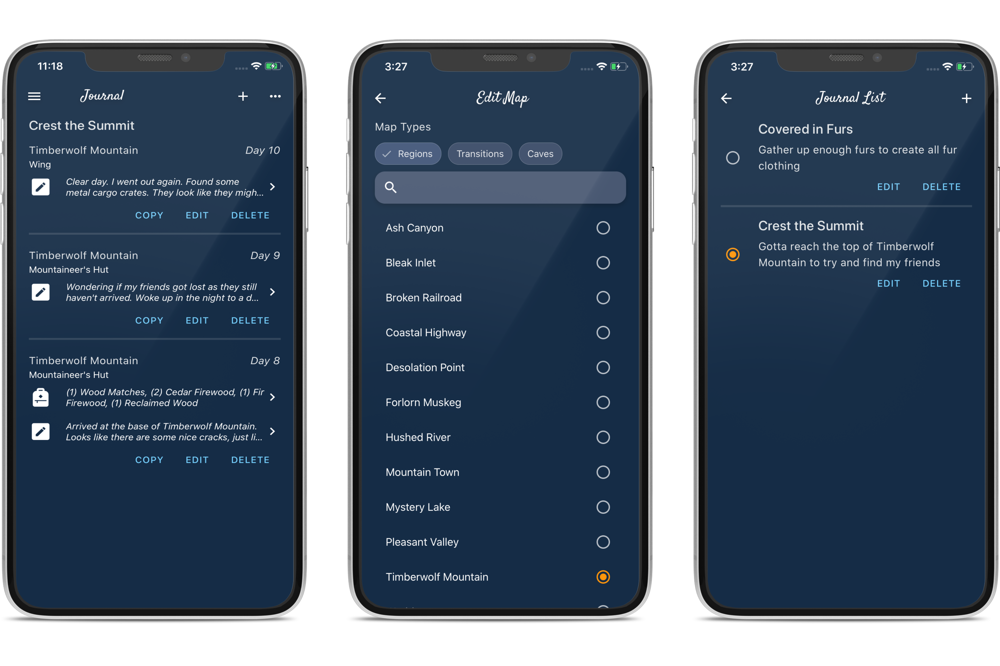

## New Additions
- Journals
  - Map
  - Location
  - Items
  - Notes
- Multiple Entries
- Multiple Journals
- World Map

## What's Next? 

1. Item corrections
1. Celsius Temperatures
1. Item Searching and Filtering

## Notes

### Journaling

I've been very excited to get this one out. I'm currently doing a run where I am trying to Ash Canyon to cross the bridge for the first time. While building up supplies in Pleasant Valley, I kept wishing I could finish journaling so I could keep up with all the items I was collecting in the Community Hall.

After about a month, it is finally here. I am very pleased with the look of it. It took quite a few iterations to get something I thought was good enough. There are a few improvements that I might try to make in the future. To start, I'd like to be able to search through my entries to find items I might want to go get. Like if I know I had a rifle at some point, but dropped it somewhere. I'd also like to be able to directly jump from a journal entry to a map. 

The journal was a little bit of a shot in the dark, because so many people were asking for "logs", "journals" etc., but I didn't have time to reach out to everyone to walk through what they were expecting. I did consider creating some [wire frames](https://balsamiq.com/learn/articles/what-are-wireframes/) at one point, but I also thought that make take too long to gather all that feedback. Also in general, the harder parts of getting this made was storing all the information around journals, so changing the UI can have a quick turn around. If you run into issues or think something is missing, feel free to use the [Feedback Form](https://forms.gle/wQsRUJqf3VLDucHdA) to share you ideas. 

### Item Feedback

There has been a lot of feedback helping me find issues with some of the items that were recently added. Thank you! 
I had a lot of data coming in on the item feature, so it was tough to catch all the issues. Correcting these issue should be easy to fix and should be out very quickly. 

