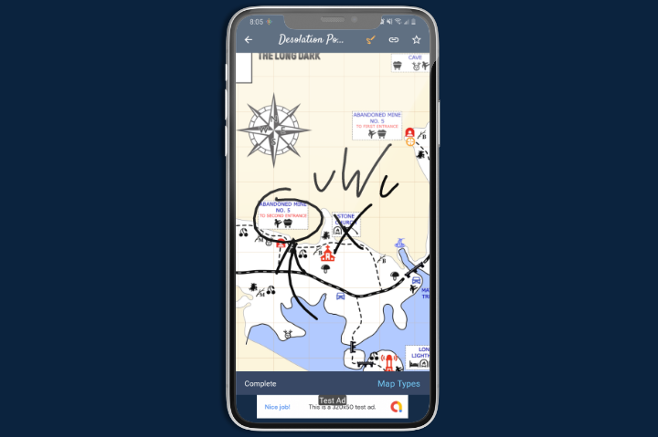

## New Additions
- Clothing and Food Sorting
- Landscape Mode
- Pound Display
- Fahrenheit Display

## What's Next? 

1. In App Purchase to Remove Ads
1. Drawing On Maps

## Notes

### In App Purchases (IAP)

I have decided to go ahead and move away from using Expo, so that we can add an option to remove ads. I have been working on and testing IAP, so an IAP for removing ads should be coming to the app very soon. 

I am having to relearn how to do some basic things like building the app and releasing updates. There are pros and cons when moving away from Expo, but some near future benefits we can see is faster boot times, decrease the apps overall size, and this allows us to do drawing. 

### Drawing on Maps

After many reviews and feedback submissions asking for drawing I was able to get something going to allow everyone to draw on the map. I was able to get the drawing going, but am still working on saving them. 

I will be adding some kind of premium versions of drawing to the app as an In App Purchase, but I will offer some basic drawing for free. 
